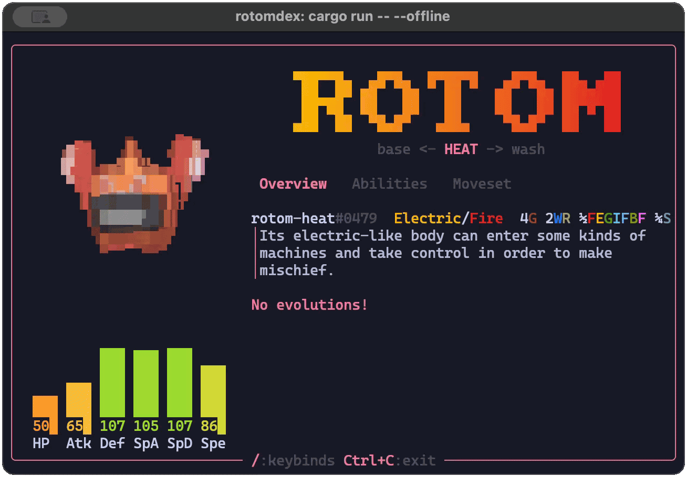

# `rotomdex`

`rotomdex` is a Pokédex built for the terminal.

## Features

- Demand-driven asynchronous asset fetching
- Hotswappable versions
- Offline mode
- Designed for 80x24

## Installation

> [!TIP]
> Try out a fully-featured version [on the web](https://zdragg.github.io/rotomdex)!

On MacOS/Linux:
```sh
curl --proto '=https' --tlsv1.2 -LsSf https://github.com/zdragg/rotomdex/releases/latest/download/rotomdex-installer.sh | sh
```

On Windows:
```powershell
powershell -ExecutionPolicy Bypass -c "irm https://github.com/zdragg/rotomdex/releases/latest/download/rotomdex-installer.ps1 | iex"
```

or download from [Releases](https://github.com/zdragg/rotomdex/releases/latest/).

If you want to install from the repository, install `git` and [rustup](https://rustup.rs/), then run:
```sh
git clone https://github.com/zdragg/rotomdex.git
cd rotomdex
cargo install rotomdex
```

## Usage

```bash
# Run in online mode
rotomdex

# Download assets required for offline mode
rotomdex --download

# Run in offline mode
rotomdex --offline
```

## Feature requests

Feature requests are VERY welcome. Please open an issue to discuss what feature you would like.

## Contributing

Pull requests are EVEN MORE welcome. For major changes, please open an issue first
to discuss what you would like to change.

## License

[AGPL-3.0-or-later](https://choosealicense.com/licenses/agpl-3.0/)

## Credits

[PokéAPI](https://pokeapi.co/)

[Ratatui](https://ratatui.rs/)
